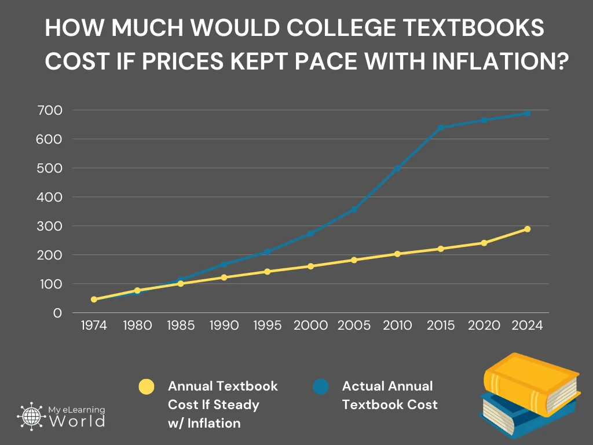

  
# About OER-Forge

[**Jump to Font Controls**](#font-controls)

OER-Forge is an open-source project dedicated to building accessible, high-quality, and modern educational resources for physics and computational science. Our mission is to empower educators, students, and lifelong learners by providing free, adaptable, and open materials—while supporting a transparent, collaborative, and sustainable approach to educational publishing.

Below is a plot of the rising cost of textbooks over time. It shows a 2.8 times the rate of inflation increase in textbooks costs. And it shows a nearly 1400% increase in real dollars over the time time. 

Full disclosure. This plot is from [My eLearning World](https://myelearningworld.com/textbook-prices-vs-inflation/), which advocates for eLearning solutions. But the costs of those are still borne by students. Both textbooks and eLearning solutions are often behind paywalls, expensive, and not accessible to all students. 

This is where [Open Educational Resources (OERs)](https://en.wikipedia.org/wiki/Open_educational_resources) come in. OERs are free, openly licensed educational materials that can be used, adapted, and shared by anyone. They provide an alternative to traditional textbooks and eLearning solutions, making education more affordable and accessible.

## Our Mission
- **Accessibility:** We design all resources to be usable by everyone, including people with disabilities, and available in multiple formats (HTML, PDF, Markdown, LaTeX, Jupyter, and more).
- **Openness:** Everything is [open source](https://github.com/OER-Forge) and [free to use, modify, and share for non-commercial use](https://github.com/OER-Forge/OER-Forge/blob/main/LICENSE). We challenge the corporate control of educational content and promote equitable access for all.
- **Collaboration:** OER-Forge is a community effort—anyone can contribute, whether you're an educator, student, developer, or enthusiast. [Pull requests](https://github.com/OER-Forge/OER-Forge/pulls), [suggestions](https://github.com/OER-Forge/OER-Forge/issues), and [feedback](mailto:hello@oerforge.org) are always welcome.
- **Simplicity:** Our sites and materials are intentionally simple, semantic, and easy to use, modify, and distribute, ensuring broad compatibility and accessibility.
- **Transparency:** The build process, content, and code are open and documented for contributors and users alike.

## Who We Are
OER-Forge is being developed by [Danny Caballero](https://dannycab.github.io/), professor of physics and computational science at Michigan State University. The project is inspired by years of teaching, learning, and collaborating with others who share a passion for open, equitable education.

## Projects
- **Modern Classical Mechanics:** The first major course site built with OER-Forge, providing interactive, accessible resources for teaching and learning classical mechanics. [Visit Modern Classical Mechanics](https://dannycaballero.info/modern-classical-mechanics/)
- **Future Courses:** OER-Forge is designed to support many classes and topics. Modern Classical Mechanics is just the beginning—more courses and resources are coming soon.

## Philosophy & Design Principles
1. **Open source and free:** All code and content are open and freely available.
2. **Accessibility first:** We follow best practices and continually improve to meet WCAG and other standards.
3. **Community-driven:** Anyone can contribute—suggest changes, add content, or improve materials.
4. **Simple, semantic, and accessible design:** We use semantic HTML, ARIA roles, and keyboard navigation to ensure usability for all.
5. **Transparent and documented:** The build process and project management are open for all contributors.

## Accessibility Commitments
- Ongoing work to ensure all materials are accessible and usable by people with disabilities
- Keyboard navigation and screen reader compatibility
- High color contrast and readable font sizes
- Descriptive alt text and link text
- Open build process and documentation for contributors

## How to Contribute
We welcome contributions from anyone interested in improving open educational resources:
- Suggest new content or improvements
- Report issues or bugs
- Review or submit pull requests
- Add new activities, simulations, or resources
- Help improve accessibility and design

You can contribute by creating an issue or pull request on our [GitHub repository](https://github.com/open-physics-ed/open-physics-ed-org.github.io).

## Contact & Community
- [OER Forge on GitHub](https://github.com/OER-Forge)
- [OER Forge on Bluesky](https://bsky.app/profile/oerforge.org)
- [Email](mailto:hello@oerforge.org)
- [Buy us a coffee](https://www.buymeacoffee.com/dannycab)

---

OER Forge is open source and always evolving. Join us in building a more accessible, equitable future for physics education and open science.
